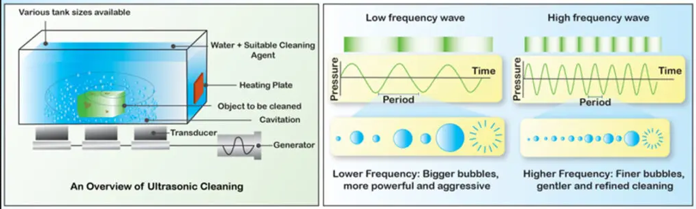
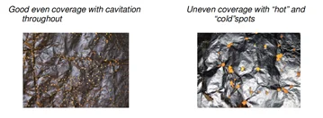
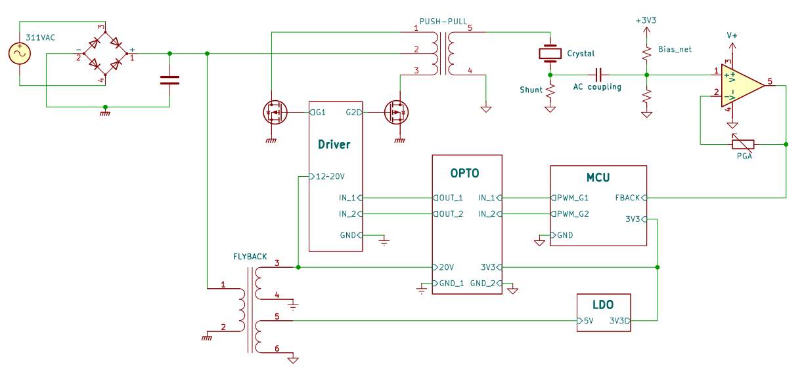
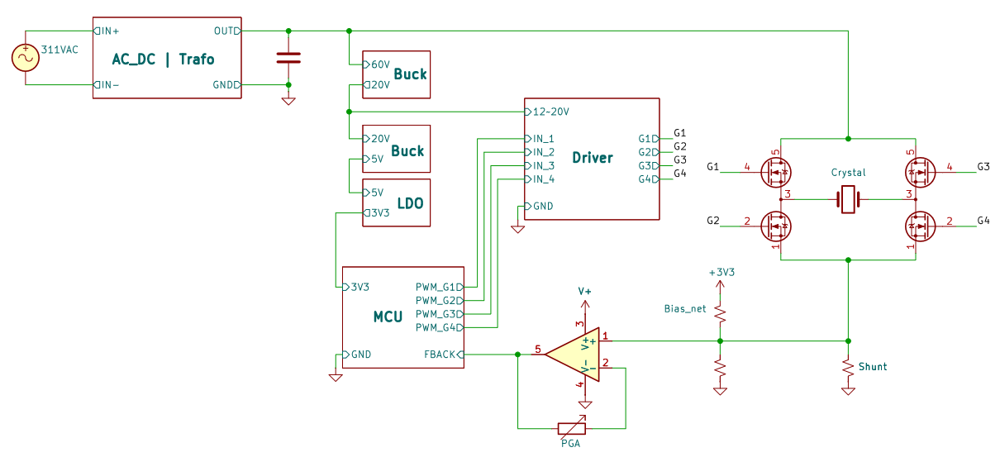
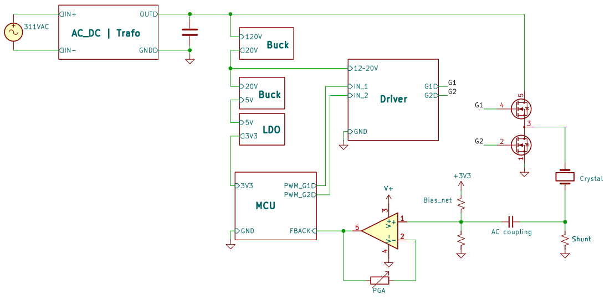
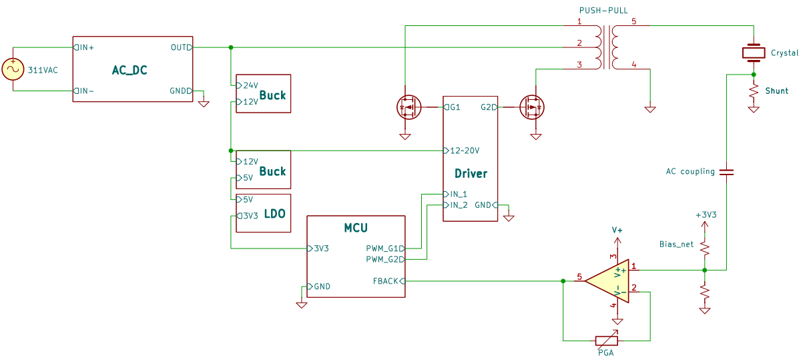
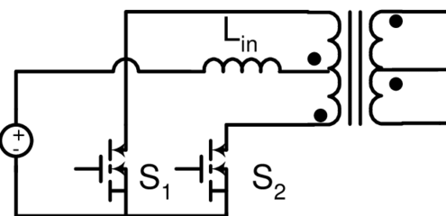
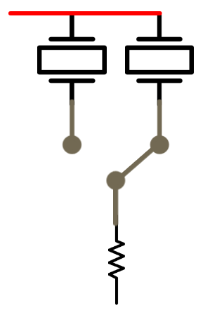

# Etapa 1 - Conceito

A etapa 1 visa, principalmente, entender o princípio de funcionamento de um limpador ultrassônico e analisar topologias de *design*, com o objetivo de encontrar uma abordagem alternativa às técnicas popularmente utilizadas no mercado.

## Contextualização: O Limpador Ultrassônico

**Utilidade:** O limpador ultrassônico serve para realizar a limpeza de objetos por meio de ondas ultrassônicas, permitindo remover resíduos de difícil acesso.

**Funcionamento:** Um sinal elétrico alternado é aplicado a um transdutor piezoelétrico, que converte a energia elétrica em vibrações mecânicas, transmitindo-as para o líquido no recipiente. Quando a frequência da vibração é maior que 20 kHz, o resultado são ondas ultrassônicas.

**A reação em cadeia:** Quando as ondas ultrassônicas se propagam pelo líquido, surgem pequenas bolhas de vapor ou gás. Essas bolhas crescem dependendo da frequência do sinal e, posteriormente, implodem rapidamente devido às variações de pressão provocadas pela onda ultrassônica, desprendendo partículas de sujeira, gordura e outros contaminantes. Dependendo da faixa de frequência trabalhada, a limpeza pode ser *bruta* ou *fina*, conforme a tabela abaixo:  

| Faixa de Frequência (kHz) | Aplicações Típicas |
| :-----------------------: | :----------------- |
| 20-40 | Remoção de ferrugem, sujidade pesada, limpeza de peças mecânicas, limpeza industrial |
| 40-80 | Limpeza de joias, relógios, instrumentos cirúrgicos, limpeza de peças eletrónicas |
| 80-170 | Limpeza de componentes eletrônicos sensíveis, limpeza de lentes, limpeza de peças com geometria complexa |

  
Na seguinte figura, um resumo visual do que foi explicado até agora:
  

    
  
**Problema:** Podem haver, entretanto, áreas sujeitas a cancelamento devido à interferências destrutivas. O cancelamento gera ondas estacionárias que criam bolsões de ar na solução de limpeza. Essas áreas são chamadas de *"zonas mortas"*.  

O contrário também pode acontecer, onde áreas de muita intensidade são formadas, podendo acabar danificando o material no recipiente. Essas áreas são chamadas *"zonas quentes"*.   

   

Nestes casos, a limpeza não será uniforme e pode diminuir signficativamente sua eficiência. Para resolver esse problema, pode-se adotar uma pequena variação de frequência em torno da frequência de ressonância do piezo, chamada de **SWEEP**.

### O Piezoelétrico

O cristal piezoelétrico pode ser descrito como um filtro passa-faixa, representado pelo modelo **Butterworth-Van Dyke (BVD)**, mostrado abaixo.  

   

O circuito tem duas partes:

- **Braço de *movimentação*(motional arm):** Representação elétrica da vibração mecânica do cristal, composto por:
    - $L_m$: Inércia do cristal vibrando;
    - $C_m$: Elasticidade do cristal;
    - $R_m$: Perdas energéticas.

- **Capacitância de placa**: 
    - $C_p$: Eletrodos nas extremidades do cristal são placas de prata, formando uma estrutura metal-dielétrico-metal.

### Impedância vs Frequência

Por se tratar de uma estrutura de duas partes, o piezo tem duas frequências de ressonância: série e paralelo.

- $Série$

    Há uma frequência específica na qual o capacitor e o indutor se anulam, ocorrendo a ressonância série. Tanto o módulo quanto a fase de $L_m$ e $C_m$ se anulam, sobrando apenas a resistência real $R_m$. A impedância do braço é mínima e a corrente tende a passar por ele. Essa frequência é chamada de $ressonância$.

- $Paralelo$

    Logo após a ressonância, a influência do indutor começa a sobrepassar a do capacitor e o braço começa a ter característica indutiva, formando um paralelo com $C_p$. Nesse ponto, as fases se cancelam, mas não o módulo. Portanto, a impedância é máxima. Essa frequência é chamada de $anti$-$ressonância$.  

Como mostrado nas figuras abaixo:  

  

Visualizando na forma linear:  

 

Cada piezo tem sua própria frequência de oscilação dada por sua construção física. Operar um piezo fora da oscilação significa ter a transferência de potência significativamente reduzida.

### Influência do Meio

A impedância do meio depende de fatores como: Quantidade de líquido, objetos no recipiente, fixação do cristal, temperatura, etc.

Com a variação da impedância, a frequência de ressonância do cristal também varia.

Portanto, calibrar o circuito para operar exatamente na oscilação é uma tarefa complicada.

Uma possível solução seria considerar uma malha de *feedback* de corrente e tensão para o embarcado, que poderia ajustar a frequência de chaveamento durante a operação. Essa funcionalidade se faz **opcional**.

### Controle: Frequência vs Tensão

Como vimos anteriormente, a frequência pode definir a potência efetivamente consumida em vibração. 
> $P_{total}(f)=V^2/Z(f)$ 

 Além disso, é possível controlar a potência do cristal através da tensão, com $Z$ fixo.
>$P_{total}(V)=V^2/Z$
 

### *Drive* do cristal: Analógico vs Digital

O cristal pode ser excitado com diferentes formas de onda, entre elas: **Senoidal e quadrada**.

- Senoidal: Utilizada para ultrassom de potência e para minimizar conteúdo harmônico onde é importante manter uma forma de onda pura. Para fazer o *drive* analógico, é necessário um amplificador analógico, aumentando o custo do projeto.

- Quadrada: Utilizada em projetos onde pureza espectral não é um fator crítico. Pode ser gerada por chaveamento.

Dependendo da potência, um amplificador analógico poderia sobreaquecer e ocorreria uma falha na excitação do cristal.

Na mesma linha, as mudanças bruscas de tensão da onda quadrada geram picos de corrente que podem sobreaquecer o cristal e levar a falha mecânica.

## Topologias

`OBS: Valores de tensão nessa etapa são especulativos e estão suscetíveis a mudanças`

Para realizar os controles de tensão/frequência previamente mencionados, podemos utilizar técnicas como PWM e *timers*, respectivamente, que deverão ser previstas na topologia escolhida.

Há diversas possibilidades de topologias, entre elas:

### 1) Optoacoplador
 

   

Nesta opção, o dispositivo é alimentado diretamente pela tomada e apresenta isolamento galvânico, sendo a opção mais segura em termos de manuseamento e a potência máxima.

Um *flyback* faz a conversão de níveis de tensão, enquanto um *push-pull* faz a inversão AC.

### 2) Ponte H

 

   

Nesta opção, é usada uma fonte externa ou um transformador com retificação.

Uma ponte H faz a inversão AC.

### 3) Meia-ponte H

 

  

Essa opção apresenta a mesma ideia da opção anterior, mas com duas chaves a menos. No entanto, a tensão sobre a ponte deve ser o dobro para realizar o mesmo trabalho.

### 4) Fonte externa + Casamento de impedância

 

  

Nesta opção, uma fonte externa (de 12V a 24V) é usada para alimentar o circuito e abaixadores convertem os níveis de tensão.

Um *push-pull* com chaves *low-side* faz a inversão AC e reflete a impedância do secundário (cristal) para o primário.

Há a possibilidade de introduzir um indutor, criando um *push-pull* alimentado por corrente para linearizar o movimento do cristal:

  

 Há ainda a possibilidade de usar cristais de forma alternada na mesma estrutura usando chaves, por exemplo:

  

## Objetivos Gerais do Projeto

- Entender o funcionamento de um limpador ultrassônico
- Pesquisar e entender o comportamento do piezoelétrico e formas de controle

## Referências

- [The Butterworth-Van Dyke (BVD) Equivalent Circuit](https://www.bohrium.com/en/sciencepedia/feynman/keyword/bvd_equivalent_circuit)

- [Indoor Ionic Propulsion Technology –  High Voltage Power System Design](https://www.researchgate.net/publication/224441680_Indoor_ionic_propulsion_technology_-_high_voltage_power_system_design)

- [YUNYISONIC: High-Frequency Ultrasonic Cleaning in the Lab: When and Why It Matters](https://www.yunyisonic.com/high-frequency-ultrasonic-cleaning-in-the-lab-when-and-why-it-matters/?srsltid=AfmBOopkQFBerbvCK0ieflRaHmwUs67991eDK0i3NRQh7iqhvNpcaU_K)

- [Piezo SHOCK Show #35: Should I use a square or sine drive for my ultrasonic transducer?](https://www.youtube.com/live/YDQwkWBjVQU)

- [Ultrasound Physics Explained - What causes attenuation of sound waves?](https://www.youtube.com/watch?v=HbuTnQ_bbHA)

- [The Essential Guide to Ultrasonic Cleaning for Industry](https://www.theflexofactor.com/flexo-factor-blog/the-essential-guide-to-ultrasonic-cleaning-for-industry/?srsltid=AfmBOopLZJYfG1_F1-hMm2M-t2mfyKtTtLg-49GMPYYZXeJK91pBs5FY)

