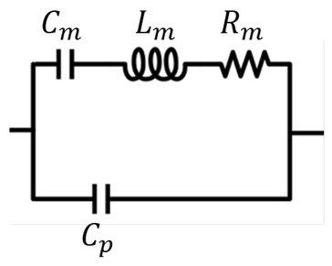
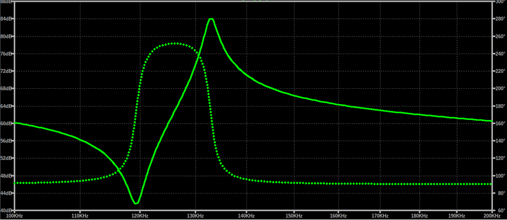
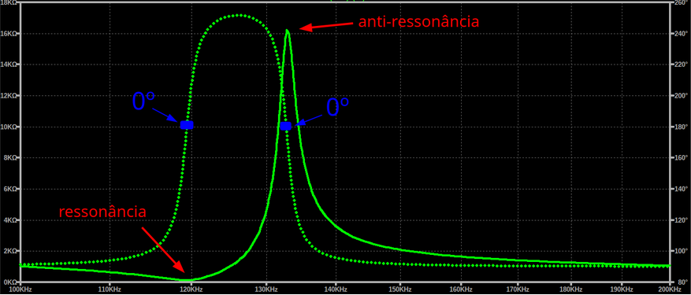

# Etapa 1 - Conceito

A etapa 1 visa principalmente entender o princípio de funcionamento de um limpador ultrassônico e analisar topologias de *design*, introduzindo uma abordagem alternativa às técnicas popularmente utilizadas no cd mercado.

## Contextualização: O Limpador Ultrassônico

Um limpador ultrassônico é um equipamento utilizado para realizar a limpeza de objetos por meio de ondas ultrassônicas, permitindo remover sujeiras, resíduos, óleos e partículas de regiões de difícil acesso e é utilizado em áreas como eletrônica, odontologia, indústria, laboratórios e manutenção de peças.

O funcionamento do equipamento baseia-se na transformação de energia elétrica em vibrações mecânicas de alta frequência: Um sinal elétrico alternado é aplicado a um transdutor piezoelétrico, que converte a energia elétrica em vibrações mecânicas e as transmite para o líquido no recipiente de limpeza.

O transdutor piezoelétrico sofre deformação mecânica quando submetido a uma tensão elétrica, expandindo e contraindo alternadamente se a tensão for alternada e vibrando na frequência do sinal elétrico. Quando a frequência da vibração é maior que 20 kHz, o resultado são ondas ultrassônicas.

Quando as ondas ultrassônicas se propagam pelo líquido surgem pequenas bolhas de vapor ou gás. Essas bolhas crescem e, posteriormente, colapsam rapidamente devido às variações de pressão provocadas pela onda ultrassônica, desprendendo partículas de sujeira, gordura e outros contaminantes. Dessa forma, a limpeza ocorre sem a necessidade de contato mecânico direto entre uma ferramenta e o objeto.

### O Piezoelétrico

A representação elétrica do cristal piezoelétrico pode ser descrito seguindo o modelo **Butterworth-Van Dyke (BVD)**, representado pelo circuito abaixo. 

O circuito tem duas partes:

- **Braço *motional***: Representação elétrica da vibração mecânica do cristal.
    - $L_m$: Representa a inércia da massa do cristal vibrando.
    - $C_m$: Representa a elasticidade do cristal.
    - $R_m$: Representa perdas de energia do mecanismo, como fricção, resistência do ar, etc.

- **Capacitância de placa**: Surge porque os eletrodos nas extremidades do cristal são placas de prata, formando uma estrutura metal-dielétrico-metal.

### Impedância vs Frequência

Por se tratar de uma estrutura de duas partes, o piezo tem duas frequências de ressonância: série e paralelo ($f_S$ e $f_P$).

- $f_S$

Há uma frequência específica onde o capacitor e o indutor se anulam e ocorre uma ressonância série.
Nesse ponto, tanto o módulo quanto a fase de $L_m$ e $C_m$ se anulam e sobra quase que apenas a resistência real $R_m$, portanto a impedância do braço é mínima e a corrente tende a passar por ele.
Essa frequência é chamada de $ressonância$.

- $f_P$

Logo após a ressonância, a influência do indutor começa a sobrepassar a do capacitor e o braço começa a ter característica indutiva, montando um indutor em paralelo com $C_p$. Isso forma um tanque LC paralelo.
Nesse ponto, as fases se cancelam, mas não o módulo. Portanto a impedância é máxima.
Essa frequência é chamada de $anti$-$ressonância$.

 

Visualizando na forma linear:

 

Cada piezo tem sua própria frequência de oscilação dada por sua construção física. Operar um piezo fora da oscilação significa ter a transferência de potência significativamente reduzida.

### A Impedância do Meio
- variação conforme quantidade de objetos, líquido, piezo sozinho, piezo com bacia, etc.

### Controles: Frequência vs Tensão

Como vimos anteriormente, é possível controlar a potência do cristal de duas formas: Tensão e frequência.

Se tivermos, por exemplo um piezo que oscila a 120 kHz e a impedância nesse ponto é de 140 Ohms, considerando uma entrada de 20V temos:

$$ P = R \cdot I² = R \cdot (\frac{V}{R})² = 140 \cdot (\frac{20}{140})² \approx 2.86 W $$

Agora o tirarmos da ressonância e operarmos em, por exemplo, 125 kHz onde a impedância é 1.02 kOhms:

$$ P = R \cdot I² = R \cdot (\frac{V}{R})² = 1020 \cdot (\frac{20}{1020})² \approx 0.39 W $$

Agora, com o mesmo cristal, se alterarmos a tensão de 20V para 10V, a potência cairá 4 vezes:

$$ P = R \cdot I² = R \cdot (\frac{V}{R})² = 140 \cdot (\frac{10}{140})² \approx 0.71 W $$

Os limpadores comerciais genéricos tendem a usar um oscilador (normalmente Colppits ou Hartley) para gerar a frequência de oscilação do cristal e fazem o controle da potência variando a tensão. Uma característica dessa abordagem é que o oscilador é personalizado para um cristal específico.

O controle por frequência, no entanto, oferece duas funções principais:

1) Ajuste da potência de vibração do cristal, possibilitando limpezas delicadas por longos períodos de tempo sem danificar o objeto;
2) **Substituição do cristal para o equipamento operar em outra faixa de frequência.**

Assim, o projeto pode ser operado com diferentes cristais.

### *Drive* do cristal: Analógico vs Digital

O cristal pode ser excitado com diferentes formas de onda, entre elas: **Senoidal e quadrada**.

- Senoidal: Tende a ser utilizada para ultrassom de potência e para minimizar conteúdo harmônico em projetos onde é importante manter uma forma de onda pura no meio de propagação. Para fazer o *drive* analógico é necessário um amplificador analógico, aumentando o custo do projeto.

- Quadrada: Tende a ser utilizada em projetos onde pureza espectral não é um fator crítico. Pode ser gerada pelo chaveamento de transistores.

Dependendo da potência do cristal, um amplificador analógico poderia sobreaquecer e ocorreria uma falha na excitação do cristal.

Na mesma linha, as mudanças bruscas de tensão na onda quadrada gera picos correntes que podem sobreaquecer o cristal levar à falha mecânica.

## Topologias

`OBS: Valores de tensão/corrente nessa etapa são estipulados e estão suscetíveis a mudanças`

Há diversas possibilidades de topologias para o projeto, das quais uma será escolhida na próxima etapa. Alguns exemplos são:

### Optoacoplador

O mais profissional e indicado para alta potência.  
Apresenta maior complexidade de projeto, necessitando de várias técnicas e componentes.

### Meia-ponte H

Um conversor Buck com chave interna nessa faixa de tensão não é comum.  
*Driver high-side* nessa faixa de frequência não é comum.  
Necessário acoplamento AC.

### Ponte H

Não é necessário acoplamento AC.  
Buck com chave interna nessa faixa de tensão não é comum.  
*Driver high-side* nessa faixa de frequência não é comum.  
Necessário transformador AC-DC.

### Fonte externa + Casamento de impedância

Buck com chave interna nessa faixa de tensão é comum.  
*Driver low-side* nessa faixa de frequência é comum.  
Necessário fonte externa.  
Necessita rede de casamento de impedância.

## Objetivos Gerais do Projeto

- testar diferentes tipos de controle
- (opcional) chirp
- (opcional) feedback para autocaracterização do piezo
- possibilidade de troca de piezo
- controle de tempo e potência da limpeza

## Referências (links/datasheets/livros)

- [Butterwoth-Van Dyke](https://www.bohrium.com/en/sciencepedia/feynman/keyword/bvd_equivalent_circuit)

