# Etapa 2 - Design

Na etapa 2, objetiva-se:
- Detalhar a tolpologia escolhida na etapa 1;
- Caracterizar o piezoelétrico;
- Decidir Interface de controle;
    - Estudar possibilidade de trava de segurança;
- Definir design externo do recepiente;
- Escolher microcontrolador;
- Testes.

## Topologia 4: Fonte externa + Casamento de impedância

Por ser composta por um transformador *push-pull* que permite a conversão de energia através do casamento de impedância entre o primário e secundário, com apenas de duas chaves *low-side* para realizar a comutação, a topologia 4 é a mais adequada.  
Utilizando PWM e *timer*, o controle de potência é possível por tensão e/ou frequência, conforme Figuras 1 e 2.

<h5>Figura 1: Topologia escolhida</h5>
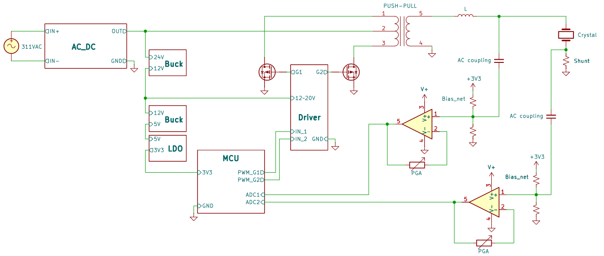

  

<h5>Figura 2: Timer e PWM</h5>
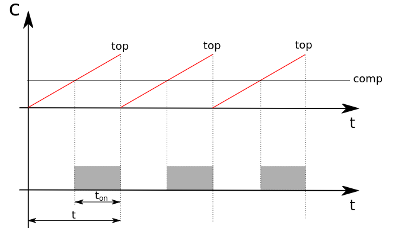

   

O cristal pode ser considerado uma carga capacitiva. Com corrente constante, a tensão no capacitor é linear, portanto há um controle fino do movimento.

<h5>Figura 3: Corrente constante X Tensão constante no capacitor</h5>
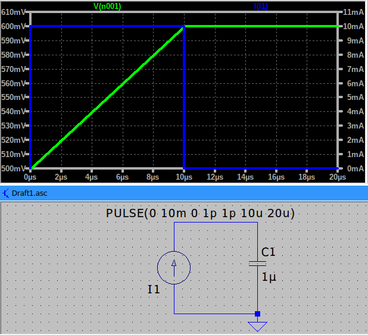
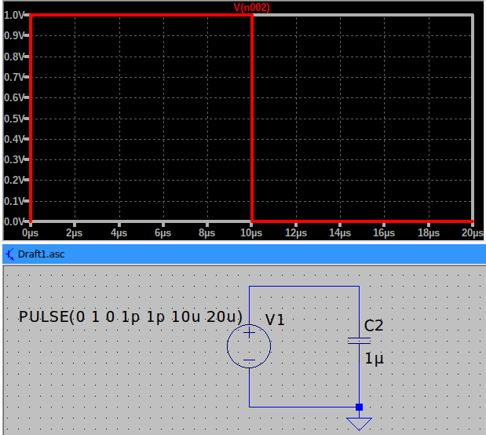

   

Como mencionado na Etapa 1, é possível adicionar um indutor em série no *tap* central do *push-pull* para fazer uma fonte de corrente. No entanto, o indutor tipicamente é grande e pode gerar picos de tensão altos na comutação das chaves.

Neste projeto, não há necessidade de controle fino da vibração, portanto podemos simplificar o projeto com fonte de tensão.

A fonte usada para a alimentação será de 24V/5A:

<h5>Figura 4: Fonte externa</h5>
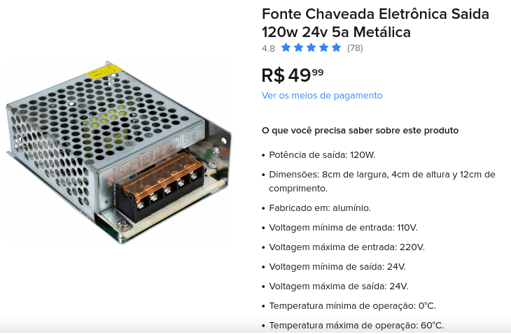

   

## Caracterização do cristal

Em um cristal piezoelétrico, o comportamento dinâmico é caracterizado por modos de vibração fundamentais: 
- Radial(planar): frequência governada pelo diâmetro, operando em faixas mais baixas (kHz);
- Axial(espessura): frequência governada pela espessura do componente, operando em frequências mais altas (MHz).

A tabela abaixo sumariza os modos de vibração e suas respsctivas aplicações. Chamamos a atenção para "*Area expansion mode*" (radial) e "*Thickness expansion mode*" (axial).

<h5>Figura 5: Modos de vibração do cristal</h5>
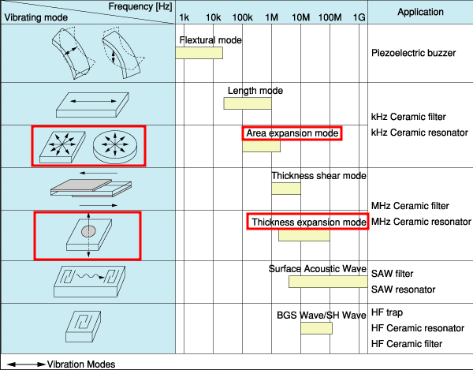

   

O modo que visamos trabalhar é o **radial**. O modo axial, por conta de sua frequência de operação muito elevada, é melhor aproveitado em aplicações como atomizadores e umidificadores.

Para caracterizar o cristal, utilizamos um osciloscópio com o seguinte *setup*:

<h5>Figura 6: Diagrama de conexões para caracterizar o cristal</h5>
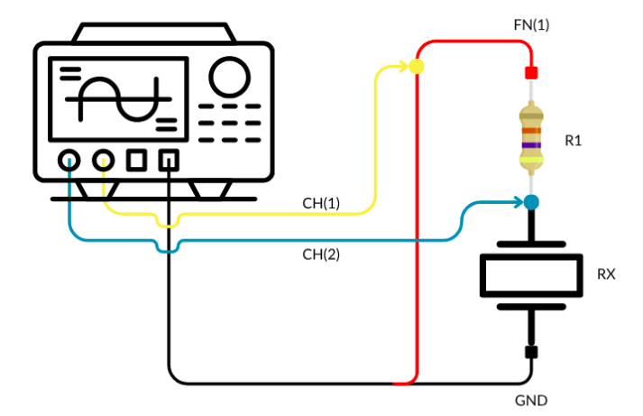

   

Para equilibrar o divisor de tensão, usamos resistores próximos a impedância estimada do cristal. 

O fabricante garante que o cristal tem uma impedância de ressonância inferior a $20 \Omega$, portanto, usamos resistores de $51.2 \Omega$ e $3279 \Omega$ para encontrar, respectivamente, a impedância de ressonância e anti-ressonância em ambos os modos axial e radial de acordo com a fórmula do divisor de tensão:

$$ V_{CH2} = V_{CH1} \frac{R_{cristal}}{R_{cristal} + R1} $$
 

### Cristal em aberto

#### Frequências do cristal

Primeiramente, obtivemos informações de frequência apenas com o resistor de $51.2 \Omega$ conectado, sem o cristal. Assim, podemos observar a influência do componente na medição do cristal.

>OBS: Há alguns momentos em que a medição no osciloscópio falha, ocasionando vales bruscos não característicos do sistema real. Essas medições estão identificadas como "nan" nos arquivos .csv disponíveis em [hardware/bode](etapa_2/hardware/bode).

<h5>Figura 7: Bode Plot com cristal desconectado</h5>
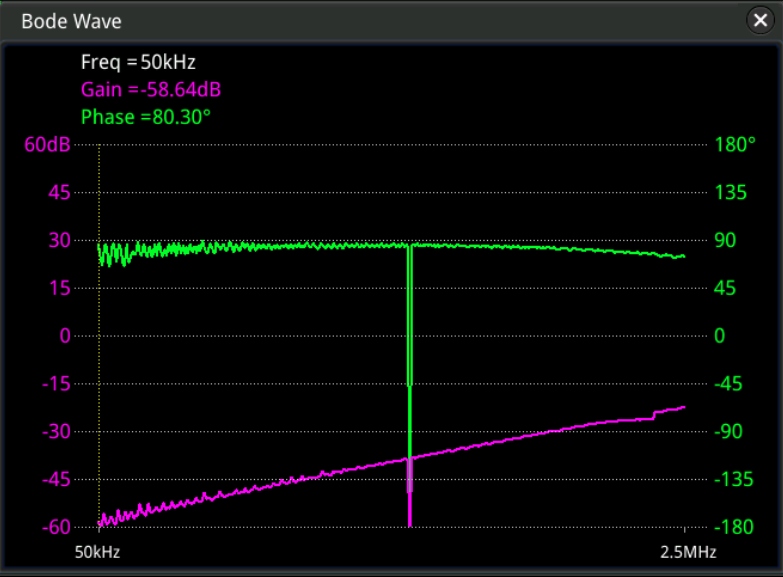

 

Exceto pelo erro de medição, o resistor não aparenta influenciar em demasia o sistema.

Agora,  as informações de frequência para cada resistor.

- Resistor de $3179 \Omega$

    

    <h5>Figura 8: Bode Plot de banda completa</h5>
    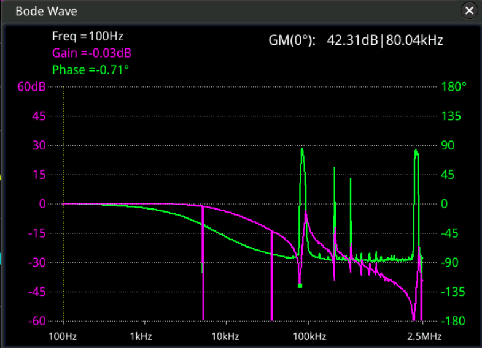
    

    

    <h5>Figura 9: Bode Plot com zoom no modo axial</h5>
    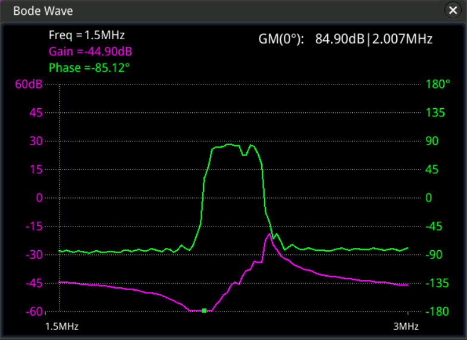
    

    

    <h5>Figura 10: Bode Plot com zoom no modo radial</h5>
    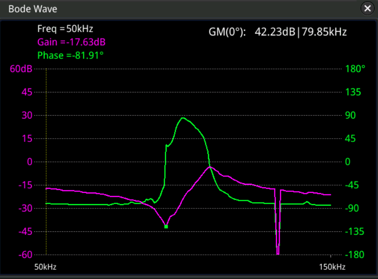
    

 

- Resistor de $51.2 \Omega$

    

    <h5>Figura 11: Bode Plot de banda completa</h5>
    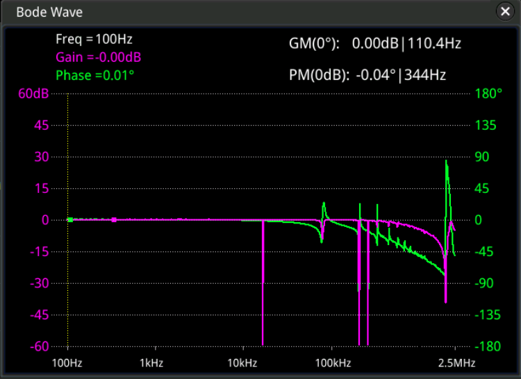
    

    

    <h5>Figura 12: Bode Plot com zoom no modo axial</h5>
    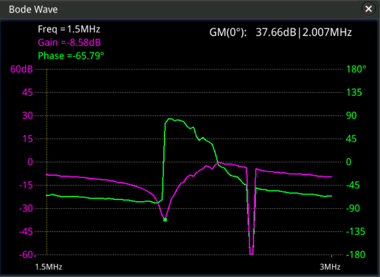
    

    

    <h5>Figura 13: Bode Plot com zoom no modo radial</h5>
    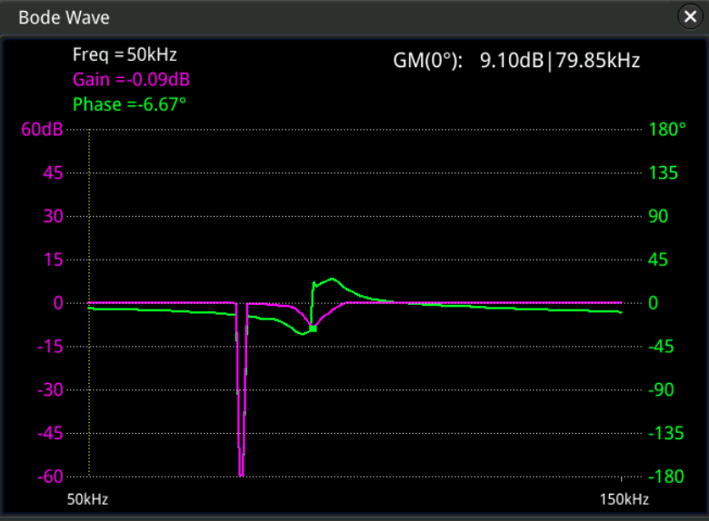
    

#### Impedância do cristal

Obtendo os valores de $V_{CH1}$ (Vamp1) e $V_{CH2}$ (Vamp2) pelo osciloscópio:

<h5>Figura 14: Resistor de 51.2Ω (Modo AXIAL)</h5>
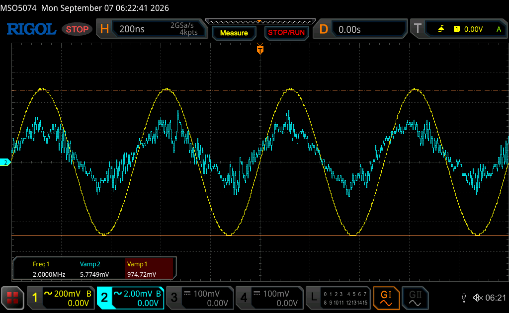

<h5>Figura 15: Resistor de 51.2Ω (Modo RADIAL)</h5>
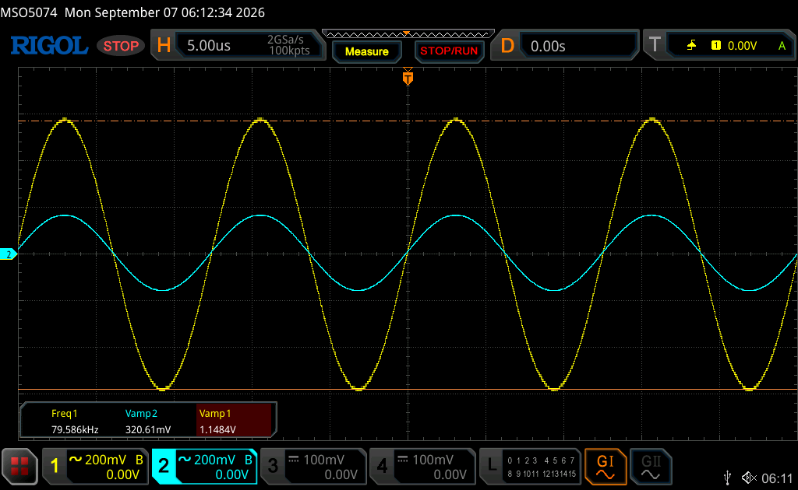

<h5>Figura 16: Resistor de 3279Ω (Modo AXIAL)</h5>
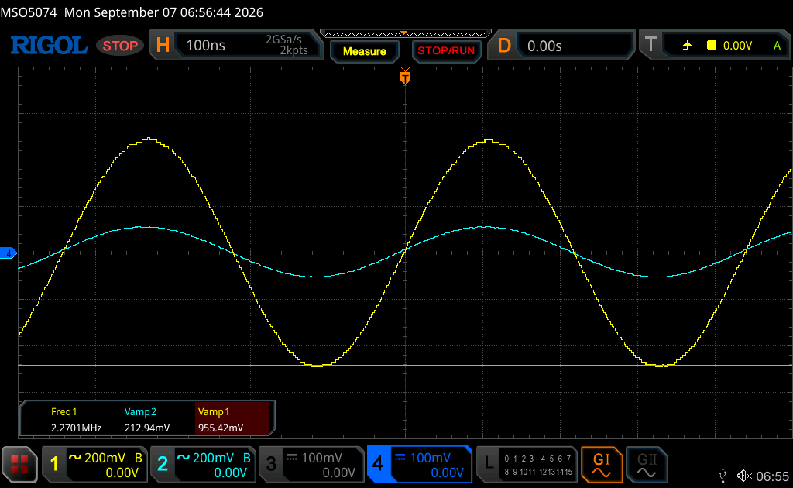

<h5>Figura 17: Resistor de 3279Ω (Modo RADIAL)</h5>
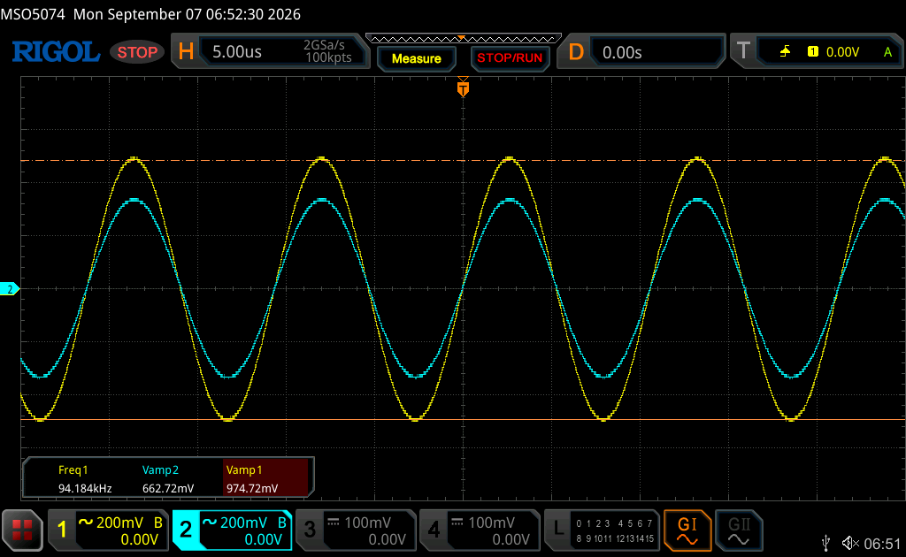

  

Com os valores de tensão conhecidos, opdemos calcular o divisor de tensão para $R_{cristal}$.

- Modo AXIAL

    - **Ressonância**

$$ 0.0057744 = 0.97472 \cdot \frac{R_{cristal}}{R_{cristal} + 51.2} \qquad \rightarrow \qquad {R_{cristal}} = 0.305 \Omega $$
    
    - **Anti-ressonância**

$$ 0.21294 = 0.95542 \cdot \frac{R_{cristal}}{R_{cristal} + 3279} \qquad \rightarrow \qquad {R_{cristal}} = 940.402 \Omega $$

- Modo RADIAL

    - **Ressonância**

$$ 0.32061 = 1.1484 \cdot \frac{R_{cristal}}{R_{cristal} + 51.2} \qquad \rightarrow \qquad {R_{cristal}} = 19.8301 \Omega $$
    
    - **Anti-ressonância**

$$ 0.66272 = 0.97472 \cdot \frac{R_{cristal}}{R_{cristal} + 3279} \qquad \rightarrow \qquad {R_{cristal}} = 6964.93 \Omega $$

 

#### Capacitância

O fabricante disponibiliza uma tabela de valores padrão para o cristal dependendo do tamanho.

O valor da capacitância de placa padrão é de $6940 \pm 15 \% \text{ pF}$. Este valor condiz com o medido com multímetro, de aproximadamente $6.241 \text{ nF}$.

<h5>Figura 18: Informações do fabricante</h5>
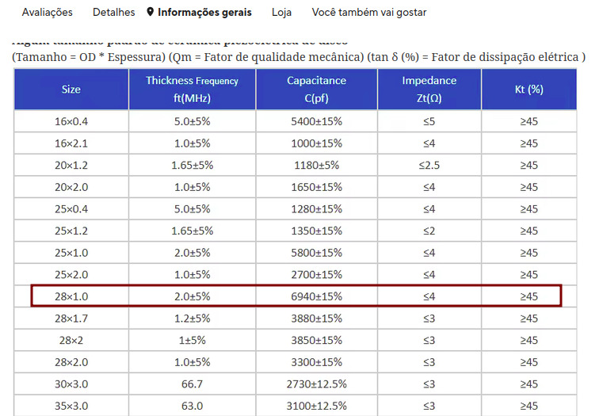

   

#### Resultados

Para o modo radial, temos os seguintes resultados:

| Parâmetro | Valor |
|:-------|:-------------|
| Ressonância | 79.85 kHz |
| Anti-ressonância | 94.54 kHz |
| Impedância na ressonância | 19.8301Ω |
| Impedância na anti-ressonância | 6964.93Ω |
| Capacitância de placa | 6.241 nF |

### Cristal fixado

Como a impedância do sistema é variável, é importante também obter os valores com o cristal fixado na estrutura de limpeza.

É aconselhado fazer pequenas ranhuras na bacia para melhor aderência do adesivo.

<h5>Figura 19: Ranhuras no ponto de fixação do cristal</h5>
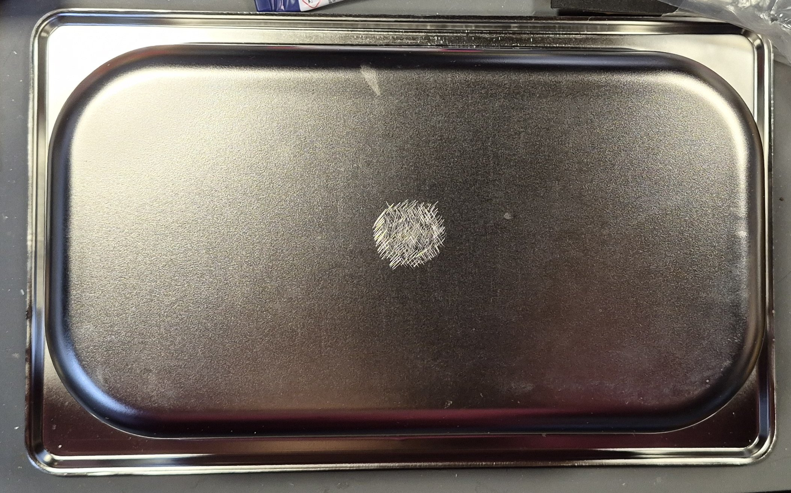

 

Foi utilizado DUREPOXI para a fixação do cristal na cuba de aço.

<h5>Figura 20: Fixação do cristal</h5>
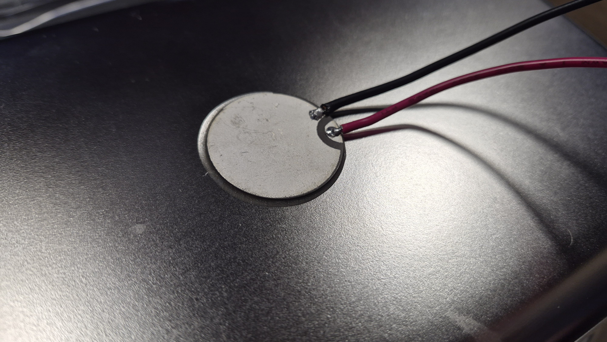
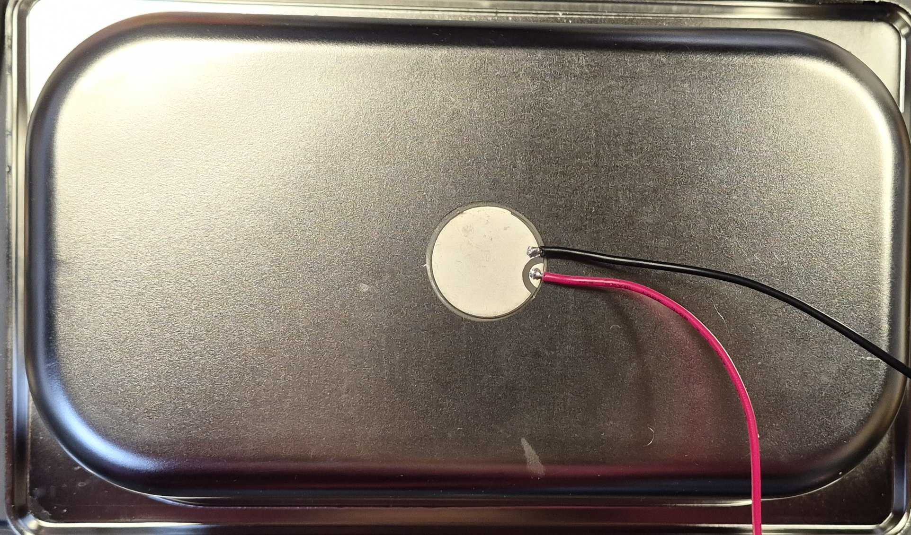

#### Frequências do cristal

#### Impedância do cristal

## Interface de controle

Para a interface de controle, optou-se por utilizar um *encoder* rotativo em conjunto com um display(OLED SSD1306 128x64 5V), que servirão de base para a interface humano-máquina.

### Trava de segurança

Uma simples tela de confirmação é o suficiente. Uma mensagem deverá aparecer confirmando se o usuário gostaria de prosseguir ou se deseja cancelar a operação.

## Design externo do recepiente

Por maior facilidade de desenvolvimento, optou-se por fabricar a carenagem impressa em 3D, levando-se em consideração a interface de controle decidida anteriormente.

## Escolha do embarcado

A seguinte tabela resume a análise de requisitos, comparando diferentes microcontroladores:

 

O requisito de frequência de amostragem foi obtido com base no critério de Nyquist(2~4x maior que a de comutação).  
O embarcado escolhido para esta aplicação foi o **STM32F303RET6**, possuindo:

- 4 ADCs de 0.14 MHz a 72 MHz;
- 4 AMPOPs internos.

<h5>Figura 21: Microcontrolador escolhido</h5>
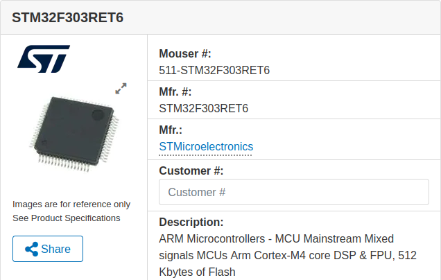

<h5>Figura 22: Features do microcontrolador</h5>

## Testes

Para a realização dos testes, foi fabricada uma PCB. A documentação detalhada se encontra em [hardware/README.md](etapa_2/hardware/README.md).

### *Display* e *encoder*

O teste feito usa o *encoder* para incrementar/decrementar um contador, enquanto uma bola quica. Ao pressionar o botão, a cor do *display* muda e a bola sofre uma força de sentido contrário.

O código está disponível em [software](etapa_2/software).

<h5>Figura 23: Teste display + encoder</h5>

### Configuração de *timer* e PWM (Sem *driver*)

Para o teste, seguimos a seguinte configuração do TIMER 1 com ARR = 1440:

| Channel | Mode          | CCR/Pulse |
| ------- | ------------- | --------: |
| CH1     | Combined PWM1 |         0 |
| CH2     | PWM1 (No output)          |       500 |
| CH3     | Combined PWM1 |       720 |
| CH4     | PWM1 (No output)         |      1220 |

 

<h5>Figura 24: Combined PWM Mode 1</h5>
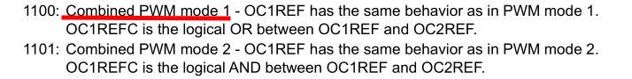

 

No modo *Combined PWM mode 1*, o referência é o OR dos sinais PWM, ou seja, o maior valor entre os canais. Neste caso, CH1|CH2 e CH3|CH4. 
Para calcular o *duty cycle*:

- CH1 | CH2

$$ D = \frac{CCR_{max}}{ARR} \qquad \rightarrow \qquad D = \frac{500}{1440} \approx 34.7\% $$

 

<h5>Figura 25: Duty do CH1</h5>
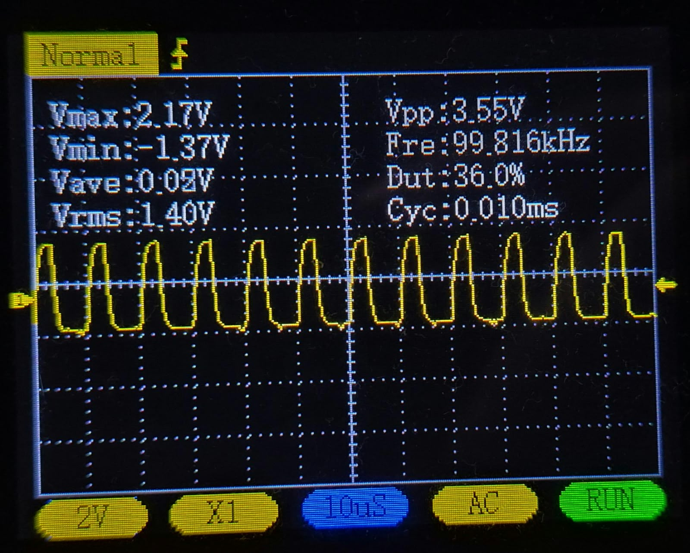

  

- CH3 | CH3

$$ D = \frac{CCR_{max}}{ARR}\qquad \rightarrow \qquad D = \frac{1220}{1440} \approx 84.7 \% $$

 

<h5>Figura 26: Duty do CH2</h5>
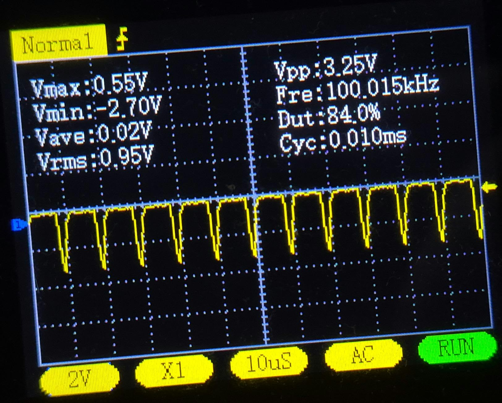

  

A partir da medição de frequência do osciloscópio podemos validar também o funcionamento do *timer*:

$$ f = \frac{f_{timer}}{ARR} = \frac{144 MHz}{1440} = 100 kHz $$

## Referências

- [YUNYISONIC: What Influences Ultrasonic Cleaning Effectiveness](https://www.yunyisonic.com/what-influences-ultrasonic-cleaning-effectiveness/?srsltid=AfmBOor3Ai7u_kyIE6ecRtDf-KHuqUFtPqL6pnWAhgAGjBU3c9__m4wV)
- [Ultrasonic Cleaner Sweep Mode | Tovatech ](https://www.youtube.com/watch?v=2wetLSvoQwQ)
- [Ceramic Resonators (CERALOCK): Vibration Modes](https://www.murata.com/products/timingdevice/ceralock/overview/basic/vibration)
- RM0316 Reference manual