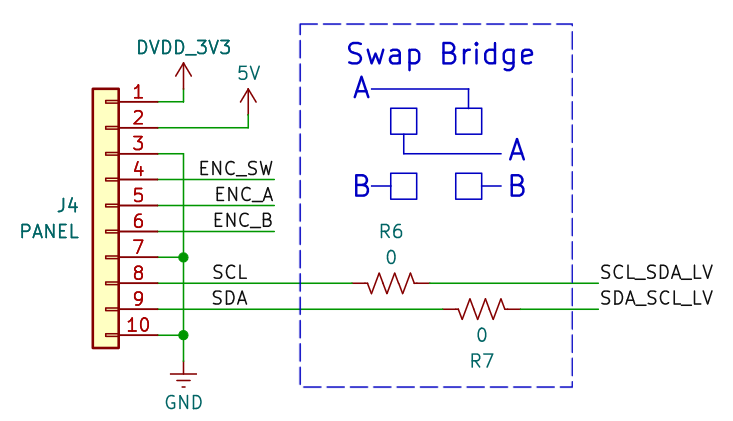
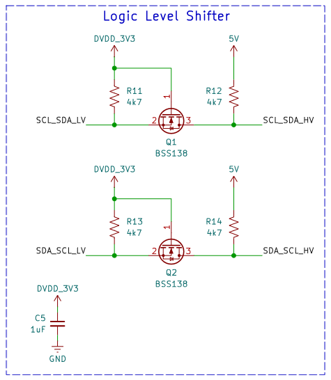
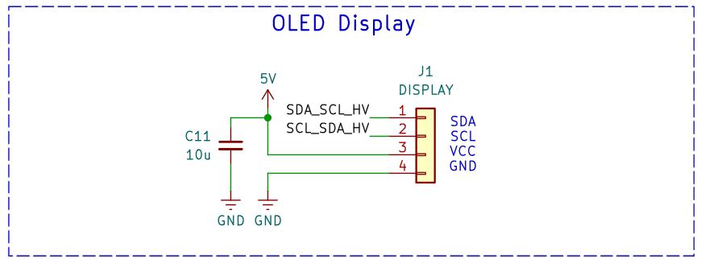
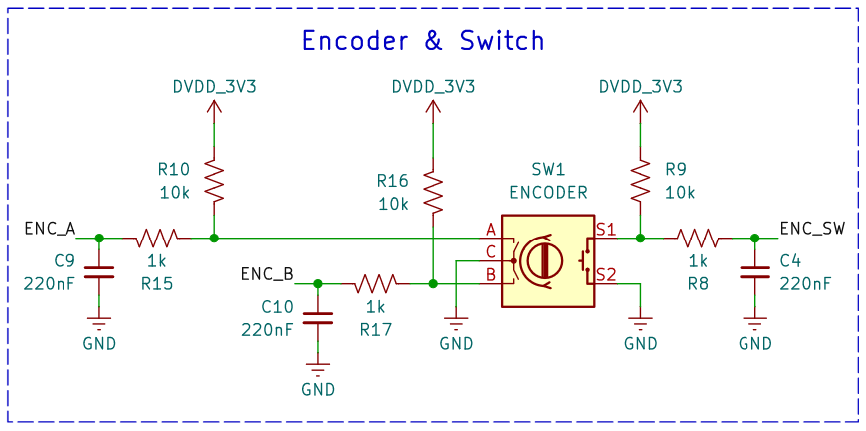
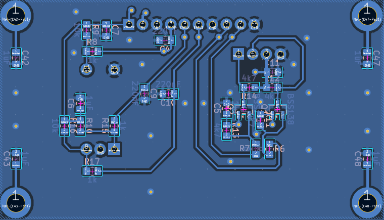
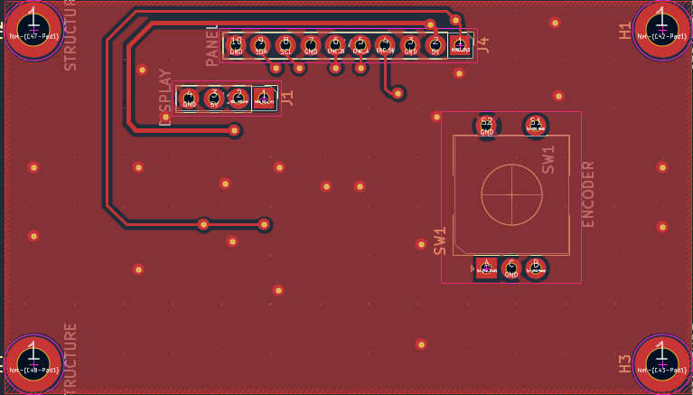
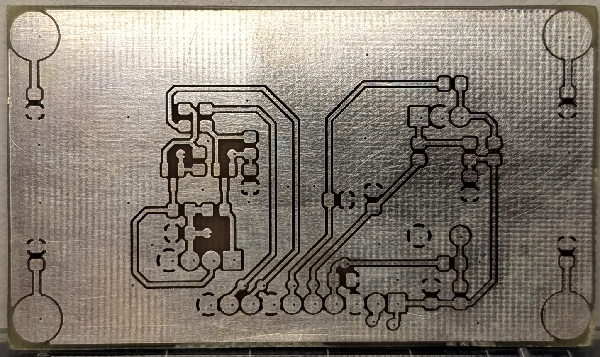
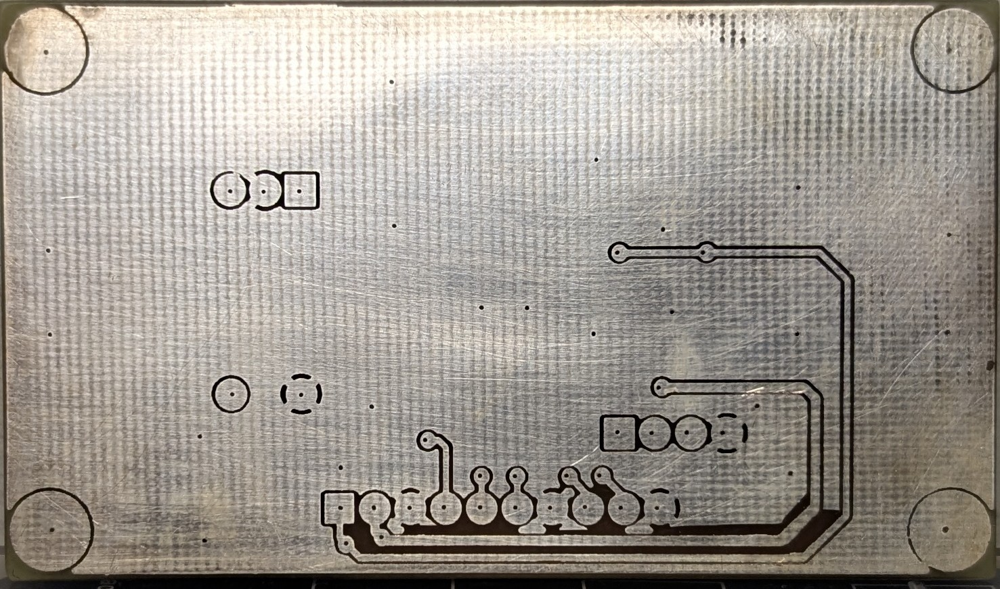

# Hardware

## Pasta: Bode

Nesta pasta encontram-se todos os arquivos .csv gerados durante a caracterização do cristal piezoelétrico, para ambos os resistores e modos.

Amostras "nan" indicam um erro na medição e devem ser desconsideradas.

## Pasta: display_pcb

Nesta pasta encontram-se os arquivos relacionados a PCB fabricada para o *display*.

- **display_test.ioc**: Arquivo de configuração do STM32F303 na CubeMX.

- **ultrasonic-cleaner-panel.pdf**: PDF do esquemático da placa.

- **ultrasonic-cleaner-panel.zip**: Projeto comprimido do KiCad.

## Esquemático

As figuras abaixo foram retiradas do esquemático do projeto.

A primeira etapa é o conector da placa, que será posteriomente conectado a placa de potência do limpador.

Para realizar a conexão SCL e SDA, é comum utilizar uma técnica de roteamento de resistores que permite o projetista soldar a conexão de dois jeitos diferentes, caso os pinos estejam invertidos no componente e o SDA seja na verdade o SCL, ou vice-versa.

Figura 1: Swap bridge

  

O *display* é 5V, então é necessário um estágio de conversão de nível lógico entre 3V3 e 5V (figuras 2 e 3).

Figura 2: Conversor de nível lógico

Figura 3: Display OLED

  

A figura abaixo mostra a conexão do *encoder* rotativo com filtros em *hardware*.

Figura 4: Encoder

  

## PCB

Abaixo seguem figuras do *layout* da placa.

Figura 5: Bottom layer

Figura 6: Front layer

  

Abaixo seguem figuras da placa fabricada (sem componentes soldados).

Figura 7: Bottom layer (fabricado)

Figura 8: Front layer (fabricado)

  
